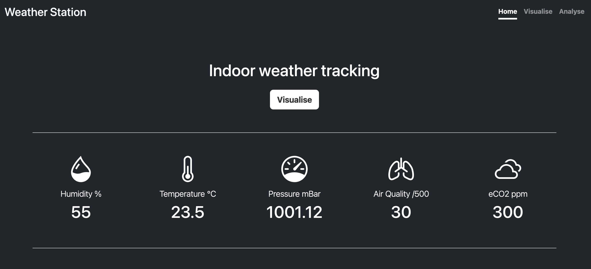

# weather-station
Home weather station with Raspberry Pi Pico &amp; Kitronik Air Quality Board




# Development

* To run the server go to the ```src``` directory and type:
```
flask --app server run --debug --host=0.0.0.0
```

* The ```rp2``` directory mirrors the scripts that will go onto the Raspberry Pi Pico. 

# Setup

## Pyenv
Use `pyenv` to change the python version for the project directory.* 
```
pyenv install 3.11.10
pyenv local 3.11
```
_\* Python 3.11 in this case to match the Raspberry Pi that will host the server for continuous data logging_

Ensure the following is in your ~/.zshrc:
```
export PATH="/Users/username/.pyenv:$PATH"
eval "$(pyenv init -)"
```

## Poetry
To set up poetry environment:
```
poetry init
poetry shell
poetry install
```

## SQLite Database
From the `src` directory, initialise the SQLite database with:
```
flask --app server init-db
```
The database will appear in the `instance` directory as `weather.sqlite`

## Raspberry Pi Pico W + Kitronik Air Quality Board
* Copy scripts from ```rp2``` onto Raspberry Pi. 
* Change constants at the top of the copy of ```send_data.py``` on the Pico:
```
SERVER_URL = 'localhost'+'/data'
WIFI_NAME = 'Wifi_name'
WIFI_PASSWORD = 'Wifi_password'
```

# Appendix
* [Kitronik Air Quality Board](https://github.com/KitronikLtd/Kitronik-Pico-Smart-Air-Quality-Board-MicroPython)
* [BME68X Sensor API](https://github.com/boschsensortec/BME68x_SensorAPI)
* [Data sheet for BME688](https://www.bosch-sensortec.com/media/boschsensortec/downloads/datasheets/bst-bme688-ds000.pdf)
  
